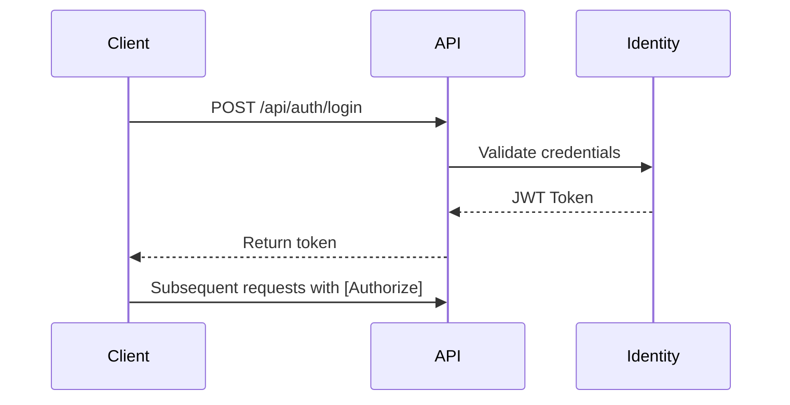

# **ECommerceAPI - Mini E-Commerce Backend System** 🛒


[](https://opensource.org/licenses/MIT)


A modern **Onion Architecture** based e-commerce backend API built with ASP.NET Core 6 and PostgreSQL.

## **🚀 Key Features**
- **Clean Architecture** with Domain-Driven Design (DDD)
- **JWT Authentication** with Role-Based Authorization
- **CQRS Pattern** implementation for complex workflows
- **Redis Caching** for high-performance product catalog
- **Dockerized** PostgreSQL and Redis containers
- **Swagger UI** with API documentation
- **Unit & Integration Tests** with xUnit and Moq

## **🛠 Tech Stack**
| Layer              | Technology                          |
|--------------------|-------------------------------------|
| **Core**           | .NET 6, C# 10                       |
| **Database**       | PostgreSQL 14, Entity Framework Core 7 |
| **Authentication** | JWT, ASP.NET Core Identity          |
| **Caching**        | Redis                               |
| **API Docs**       | Swagger/OpenAPI 3.0                 |
| **Containerization** | Docker, Docker Compose            |
| **Testing**        | xUnit, Moq, TestContainers          |

## **📦 Project Structure**
```
ECommerceAPI/
├── src/
│   ├── Core/                  # Domain Layer
│   │   ├── Entities/          # Domain models
│   │   ├── Interfaces/        # Repository contracts
│   │   └── Enums/             # Domain enums
│   │
│   ├── Application/           # Business Logic
│   │   ├── DTOs/              # Data Transfer Objects
│   │   ├── Services/          # Domain services
│   │   └── Validators/        # FluentValidation rules
│   │
│   ├── Infrastructure/        # External Concerns
│   │   ├── Persistence/       # EF Core implementations
│   │   ├── Identity/          # Auth configurations
│   │   └── Caching/           # Redis services
│   │
│   └── WebAPI/                # Presentation Layer
│       ├── Controllers/       # API Endpoints
│       ├── Middlewares/       # Exception handling
│       └── Extensions/        # Service registrations
│
├── tests/                     # Test projects
├── docker-compose.yml         # Container orchestration
└── ECommerceAPI.sln           # Solution file
```

## **⚙️ Setup & Installation**

### **Prerequisites**
- [.NET 6 SDK](https://dotnet.microsoft.com/download)
- [Docker Desktop](https://www.docker.com/products/docker-desktop)
- [PostgreSQL 14+](https://www.postgresql.org/download/) (or use Docker)
- [Redis](https://redis.io/download) (optional for caching)

### **1. Clone Repository**
```bash
git clone https://github.com/Mini-ECommerce-Application/ECommerceAPI
cd ECommerceAPI
```

### **2. Database Setup**
Using Docker:
```bash
docker-compose up -d postgres redis
```

### **3. Configuration**
Create `appsettings.Development.json`:
```json
{
  "ConnectionStrings": {
    "DefaultConnection": "Host=localhost;Port=5432;Database=ECommerceDB;Username=postgres;Password=yourpassword;"
  },
  "Jwt": {
    "Key": "your-256-bit-secret",
    "Issuer": "ECommerceAPI",
    "Audience": "ECommerceClient",
    "ExpiryInMinutes": 60
  },
  "Redis": {
    "Configuration": "localhost:6379"
  }
}
```

### **4. Apply Migrations**
```bash
dotnet ef database update --project src/Infrastructure
```

### **5. Run Application**
```bash
dotnet run --project src/WebAPI
```

Access Swagger UI at: `https://localhost:5001/swagger`

## **🔐 Authentication Flow**


## 🧪 Testing
Run unit tests:
```bash
dotnet test
```

## 🐳 Docker Deployment
Build and run:
```bash
docker-compose up --build
```

## **📜 API Endpoints**
| Method | Endpoint                | Description                  | Auth Required |
|--------|-------------------------|------------------------------|---------------|
| POST   | `/api/auth/register`    | User registration            | No            |
| POST   | `/api/auth/login`       | JWT token generation         | No            |
| GET    | `/api/products`         | List all products            | No            |
| POST   | `/api/products`         | Create new product           | Admin         |
| GET    | `/api/orders`           | Get user orders              | Yes           |

## 🤝 Contributing
1. Fork the project
2. Create your feature branch (`git checkout -b feature/AmazingFeature`)
3. Commit your changes (`git commit -m 'Add some amazing feature'`)
4. Push to the branch (`git push origin feature/AmazingFeature`)
5. Open a Pull Request

## 📄 License
Distributed under the MIT License. See `LICENSE` for more information.

## 📧 Contact
Project Maintainer - [Ismail Aydemir](mailto:ismailaydemiryt@gmail.com)

---
